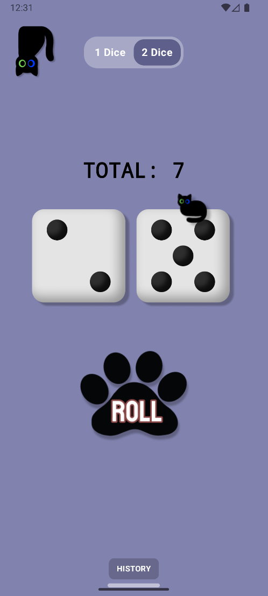
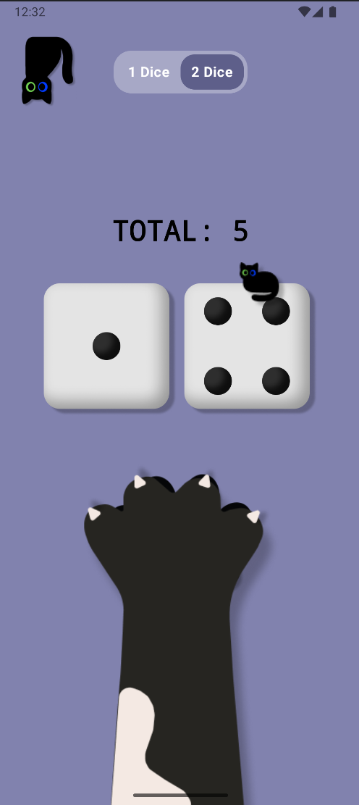
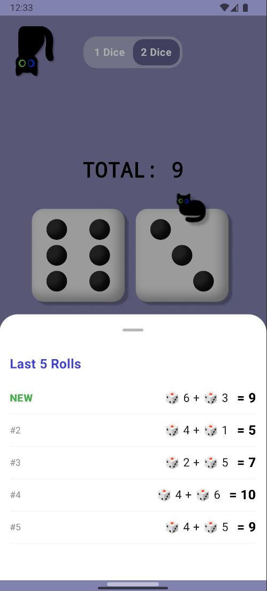

<div align="center">

<!-- Animated Header -->


<!-- Badges Row -->
<p align="center">
  
  
  
  
  
</p>

<p align="center">
  
  
  
  
</p>

<br/>

> *"Not all who wander are lost — some are just waiting for the dice to roll."*
> 
> **— A philosophical cat, probably**

<br/>

</div>

---

## 🐱 What is CatDice?

**CatDice** is a minimal, delightful dice-rolling Android app with a **cat-themed personality**. Whether you're playing board games, settling debates, or just vibing — CatDice makes rolling dice satisfying, smooth, and adorable.

You can roll by **tapping the paw button**, or — the fun part — just **shake your phone** and watch a giant cat paw swipe across the screen. 🐾

---

## 🛠️ Tech Stack

| Category | Technology |
|----------|-----------|
| **Language** | Kotlin |
| **UI Framework** | Jetpack Compose + Material 3 |
| **Architecture** | MVVM |
| **Dependency Injection** | Hilt (Dagger) |
| **Persistence** | Jetpack DataStore (Preferences) |
| **Serialization** | Gson |
| **Sensors** | Android Accelerometer (Shake detection) |
| **Animation** | `animateFloatAsState` with Spring physics |
| **CI/CD** | GitHub Actions |
| **Build System** | Gradle (Kotlin DSL) |

---
## ✨ Features at a Glance

| Feature | Description |
|--------|-------------|
| 🎲 **1 or 2 Dice** | Toggle between single and double dice modes |
| 🐾 **Shake to Roll** | Shake your device and the cat paw animates in |
| 📜 **Roll History** | Last 5 rolls saved persistently via DataStore |
| 😺 **Cat Paw Animation** | Bouncy spring animation on every roll |
| 🐈 **Little Cat on Dice** | A tiny cat sits on the second die |
| 💾 **Persistent Storage** | History survives app restarts |
| ✅ **CI/CD Pipeline** | Automated build and test via GitHub Actions |

---

## 📸 Screenshots

<div align="center">

| Main Screen | Rolling (Paw Swipe) | History Sheet |
|:-----------:|:-------------------:|:-------------:|
|  |  |  |
| Roll with a tap or shake | Giant paw animation sweeps in | Last 5 rolls in a bottom sheet |

</div>

---

## 🏗️ Architecture

CatDice follows **MVVM (Model-View-ViewModel)** architecture with clean package separation and **Dependency Injection via Hilt**.

```
📦 com.example.catdice
 ┣ 📂 data
 ┃ ┗  DiceRepository.kt        ← DataStore persistence logic
 ┣ 📂 di
 ┃ ┗  AppModule.kt              ← Hilt DI module (Gson, etc.)
 ┣ 📂 domain
 ┃ ┗  RollResult.kt             ← Core data model
 ┣ 📂 ui
 ┃ ┣ 📂 components
 ┃ ┃ ┣  GameComponents.kt       ← DiceBoard & DiceHeader
 ┃ ┃ ┣  HistoryBottomSheet.kt   ← Roll history UI
 ┃ ┃ ┗  ShakeDetector.kt        ← Accelerometer listener
 ┃ ┣ 📂 screen
 ┃ ┃ ┗  DiceScreen.kt           ← Main screen composable
 ┃ ┣ 📂 theme
 ┃ ┃ ┗  Theme.kt                ← MaterialTheme wrapper
 ┃ ┗ 📂 viewmodel
 ┃   ┗  DiceViewModel.kt        ← State & business logic
 ┣  CatDiceApplication.kt       ← Hilt application class
 ┗  MainActivity.kt             ← Entry point
```

### Data Flow Diagram

```
┌─────────────────────────────────────────────────────┐
│                     UI Layer                        │
│  DiceScreen ──► DiceHeader, DiceBoard, BottomSheet  │
└──────────────────────┬──────────────────────────────┘
                       │ observes state / triggers events
┌──────────────────────▼──────────────────────────────┐
│                  ViewModel Layer                    │
│  DiceViewModel ──► manages dice state & history     │
└──────────────────────┬──────────────────────────────┘
                       │ calls repository
┌──────────────────────▼──────────────────────────────┐
│                   Data Layer                        │
│  DiceRepository ──► DataStore (Preferences)         │
└─────────────────────────────────────────────────────┘
        ▲                              │
        │        Hilt DI               │
        └─── AppModule (Gson) ─────────┘
```

---

## ⚙️ How It Works

### 🎲 Rolling Logic
When a roll is triggered (tap or shake), the app runs a **10-frame animation loop** with random dice values before settling on the final result. The total is calculated and stored.

```kotlin
repeat(10) {
    viewModel.dice1Result = (1..6).random()
    if (viewModel.diceCount == 2) viewModel.dice2Result = (1..6).random()
    delay(60)
}
```

### 🐾 Paw Animation
The cat paw uses a **Spring animation** for a satisfying bouncy feel:

```kotlin
val animatedPawOffset by animateFloatAsState(
    targetValue = pawOffset,
    animationSpec = spring(
        dampingRatio = Spring.DampingRatioLowBouncy,
        stiffness = 450f
    )
)
```

### 📡 Shake Detection
The accelerometer measures **G-force** — when it exceeds `2.7g`, a roll is triggered with a 1-second cooldown:

```kotlin
val gForce = sqrt(gX * gX + gY * gY + gZ * gZ)
if (gForce > 2.7f && currentTime - lastShakeTime > 1000) {
    onShake()
}
```

### 💾 Persistent History
Roll history is stored in **DataStore** as JSON (via Gson), keeping the last 5 rolls across sessions:

```kotlin
val historyFlow: Flow<List<RollResult>> = context.dataStore.data.map { prefs ->
    gson.fromJson(prefs[historyKey], object : TypeToken<List<RollResult>>() {}.type)
}
```

---

## ✅ CI/CD Pipeline

CatDice uses **GitHub Actions** for automated building and testing on every push.

```
Push to GitHub
     │
     ▼
┌─────────────────────────┐
│   GitHub Actions CI/CD  │
│                         │
│  ✔ Checkout code        │
│  ✔ Setup JDK 17         │
│  ✔ Gradle build         │
│  ✔ Run unit tests       │
│  ✔ Build APK            │
└─────────────────────────┘
     │
     ▼
  ✅ Build Passing
```

> The CI/CD pipeline ensures every commit is automatically built and validated — no broken builds make it through!

---

## 🚀 Getting Started

### Prerequisites

- Android Studio **Hedgehog** or later
- JDK **17**
- Android SDK **24+**

### Installation

```bash
# 1. Clone the repository
git clone https://github.com/helinertgrl/catdice.git

# 2. Open in Android Studio
# File → Open → select the cloned folder

# 3. Let Gradle sync

# 4. Run on emulator or physical device
# Run → Run 'app'  (Shift + F10)
```

### Build from Command Line

```bash
# Debug build
./gradlew assembleDebug

# Run tests
./gradlew test

# Full build
./gradlew build
```

---

## 📦 Dependencies

```toml
# Core
androidx.compose.bom          = "2024.02.01"
androidx.activity.compose     = "1.8.2"
androidx.core.ktx             = "latest"

# Dependency Injection
hilt.android                  = "2.51.1"
hilt.navigation.compose       = "1.2.0"

# Persistence
datastore.preferences         = "1.1.1"

# Serialization
gson                          = "2.10.1"
```

---

## 🗺️ Roadmap

- [ ] Custom cat themes / skins
- [ ] Sound effects on roll
- [ ] Dark mode toggle

---

## 📁 Project Structure Summary

```
CatDice/
├── app/
│   ├── src/main/
│   │   ├── java/com/example/catdice/
│   │   │   ├── data/           # Repository + DataStore
│   │   │   ├── di/             # Hilt modules
│   │   │   ├── domain/         # Data models
│   │   │   ├── ui/             # Compose UI
│   │   │   │   ├── components/ # Reusable composables
│   │   │   │   ├── screen/     # Full screens
│   │   │   │   ├── theme/      # App theming
│   │   │   │   └── viewmodel/  # ViewModels
│   │   │   ├── CatDiceApplication.kt
│   │   │   └── MainActivity.kt
│   │   └── res/                # Drawables, assets
│   ├── build.gradle.kts
│   └── proguard-rules.pro
├── build.gradle.kts
├── .github/workflows/          # CI/CD
└── README.md
```

---

## 🤝 Contributing

Contributions are welcome! Feel free to open issues or pull requests.

1. Fork the repository
2. Create your feature branch (`git checkout -b feature/amazing-cat-feature`)
3. Commit your changes (`git commit -m 'Add some amazing cat feature'`)
4. Push to the branch (`git push origin feature/amazing-cat-feature`)
5. Open a Pull Request

---

## 📄 License

```
MIT License

Copyright (c) 2026 helinertgrl

Permission is hereby granted, free of charge, to any person obtaining a copy
of this software and associated documentation files (the "Software"), to deal
in the Software without restriction, including without limitation the rights
to use, copy, modify, merge, publish, distribute, sublicense, and/or sell
copies of the Software.
```

---

<div align="center">


**Made with 🐾 and Kotlin**

*If this project made you smile, consider giving it a ⭐*

[](https://github.com/helinertgrl/catdice)

</div>
